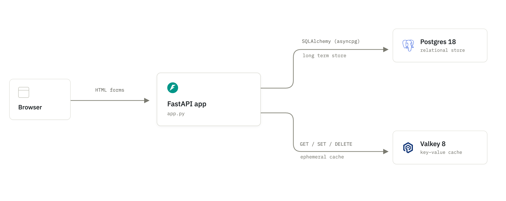
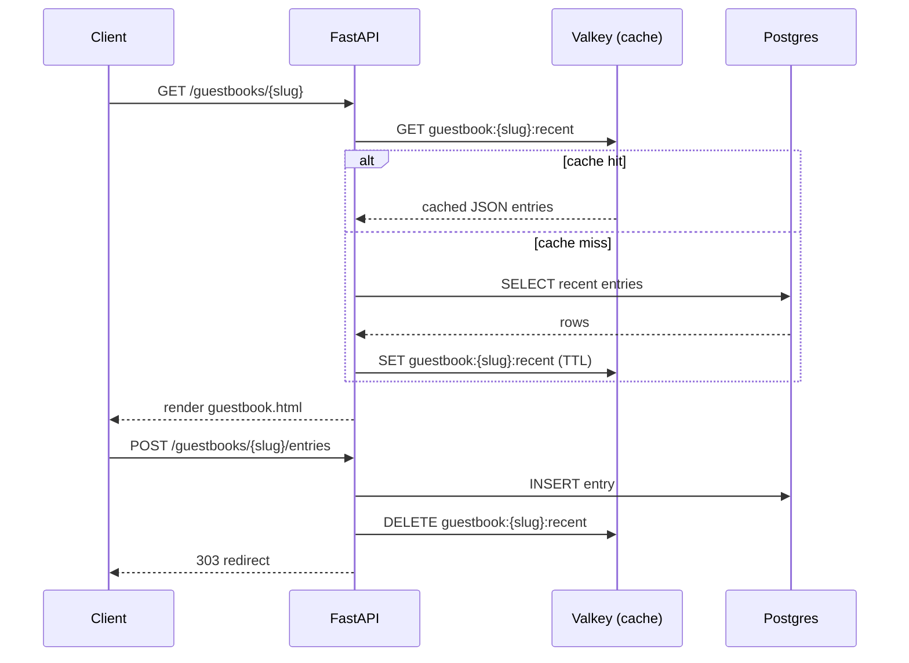

# fastAPI-db-cache-template

A minimal guestbook app demonstrating the **cache-aside** pattern with FastAPI, Postgres, and Valkey. Visitors create guestbooks and leave messages; reads are served from cache when possible and writes invalidate the cache.



**Request flow (cache-aside):**



### Components

| Component    | Role                                                                                                        |
| ------------ | ----------------------------------------------------------------------------------------------------------- |
| `app.py`     | Single-file FastAPI app: settings, SQLAlchemy models, cache-aside helpers, and routes                       |
| Postgres     | Source of truth — `guestbooks` and `guestbook_entries` tables, accessed via async SQLAlchemy (`asyncpg`)    |
| Valkey       | Cache layer for read-heavy queries (guestbook list, recent entries per guestbook), keyed by slug with a TTL |
| `templates/` | Jinja2 templates (`index.html`, `guestbook.html`) rendered server-side                                      |

### Data model

- **`Guestbook`** — `id`, `slug` (unique), `name`, `created_at`; has many `Entry`
- **`Entry`** — `id`, `guestbook_id` (FK), `name`, `message`, `created_at`

### Caching strategy

Reads (`list_guestbooks`, `recent_entries`) follow cache-aside:

1. Try Valkey first (`GET`).
2. On miss, query Postgres, then populate Valkey with a TTL (`CACHE_TTL_SECONDS`, default 900s).

Writes (`create_guestbook`, `create_entry`) write straight to Postgres, then `DELETE` the affected cache key so the next read repopulates it — no stale data waiting on the TTL.

Cache keys:

- `guestbooks:list` — the full guestbook list
- `guestbook:{slug}:recent` — the 20 most recent entries for a guestbook

## Running locally

```bash
cp .env.example .env
docker compose up --build
```

The app is served at `http://localhost:8000`. Postgres and Valkey run as sidecar services with healthchecks gating app startup; tables are created automatically on startup via `Base.metadata.create_all`.

## Development

```bash
uv sync
uv run fastapi dev app.py
```

Linting:

```bash
uv run ruff check .
```
